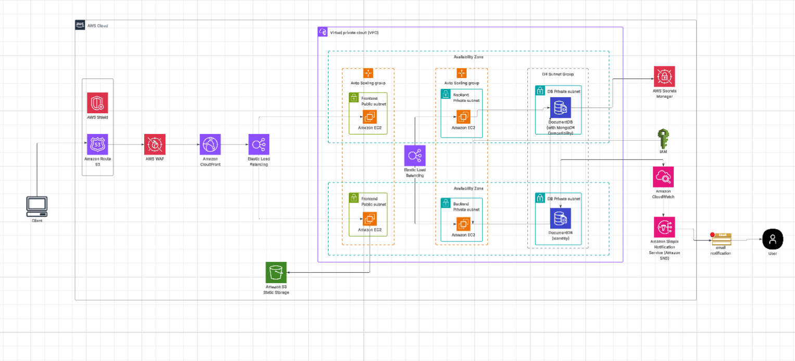

# 🚀 Scalable Web Application on AWS with High Availability, Security, and Monitoring

---

## 📚 Table of Contents

- [📘 Solution Overview](#📘-solution-overview)
- [🧭 Architecture Diagram](#🧭-architecture-diagram)
- [🛠️ AWS Services Used](#🛠️-aws-services-used)
- [🚀 Deployment Guide](#🚀-deployment-guide)
- [📊 Monitoring and Alerts](#📊-monitoring-and-alerts)
- [🔐 Security Best Practices](#🔐-security-best-practices)
- [💡 Cost Optimization](#💡-cost-optimization)

---

## 📘 Solution Overview

This project demonstrates the deployment of a **highly available, secure, and scalable 2-tier web application** on AWS. It features:

- A **frontend** and **backend** tier, each running on EC2 instances in **Auto Scaling Groups**.
- **DocumentDB** as the managed NoSQL backend (MongoDB-compatible).
- Full network isolation via **public/private subnets** across **multiple Availability Zones (AZs)**.
- Security, scalability, and observability components such as **WAF**, **Shield**, **CloudFront**, **CloudWatch**, and **Secrets Manager**.

---

## 🧭 Architecture Diagram

---

## 🛠️ AWS Services Used

### Networking & Security

- **Amazon VPC** with public/private subnets across 2 Availability Zones.
- **Security Groups**, **IAM Roles**, and **AWS Secrets Manager** for secure access control.
- **AWS Shield** and **WAF** for DDoS protection and request filtering.

### Compute & Scalability

- **Amazon EC2**: Runs the web app (frontend and backend tiers).
- **Elastic Load Balancer (ALB)**: Distributes incoming traffic to EC2 instances.
- **Auto Scaling Groups**: Ensures scalability based on traffic load.

### Content Delivery & DNS

- **Amazon Route 53**: Custom domain and DNS management.
- **Amazon CloudFront**: Global CDN with caching and HTTPS support.

### Storage & Database

- **Amazon S3**: Static storage for assets (images, scripts, etc.).
- **Amazon DocumentDB**: NoSQL document database for backend storage.

### Observability & Alerts

- **Amazon CloudWatch**: Logs, metrics, and alarms.
- **Amazon SNS **: Sends email/SMS alerts based on CloudWatch alarms.

---

## 🚀 Deployment Guide

### 🛠️ Deployment Steps

1. **Launch Infrastructure (manually or via CloudFormation)**:

   - VPC with public/private subnets
   - DocumentDB cluster in private subnets
   - Security groups and IAM roles

2. **Deploy Web App** (Frontend & Backend):

   - Install Node.js / Python / your stack of choice on EC2 instances
   - Use Auto Scaling Groups with Launch Templates
   - Backend connects to DocumentDB securely (credentials from Secrets Manager)

3. **Configure ALB + CloudFront**:
   - ALB receives traffic from CloudFront
   - CloudFront connected to Route 53 custom domain
   - WAF and Shield protect against malicious traffic

---

## 📊 Monitoring and Alerts

- **CloudWatch Metrics**:

  - CPU Utilization
  - Request count on ALB
  - DocumentDB performance

- **CloudWatch Alarms**:

  - Trigger alerts via SNS when thresholds are exceeded

- **Logs**:
  - EC2 logs (stored in CloudWatch Logs)
  - ALB and WAF logs (optional)

---

## 🔐 Security Best Practices

- 🔒 IAM roles with **least privilege** for EC2 and backend apps
- 🔒 EC2 instances in **private subnets** (backend)
- 🔒 Secrets stored in **AWS Secrets Manager**
- 🔒 HTTPS enforced with **SSL/TLS certificates** via CloudFront or ALB
- 🔒 **Security Groups** restrict access by port and source

---

## 💡 Cost Optimization

- ✅ Use **Auto Scaling** to adjust to traffic and avoid over-provisioning
- ✅ Monitor usage with **CloudWatch** and set budgets/alerts
- ✅ Consider **Spot Instances** for frontend (optional)
- ✅ Use **CloudFront caching** to reduce backend load

---
